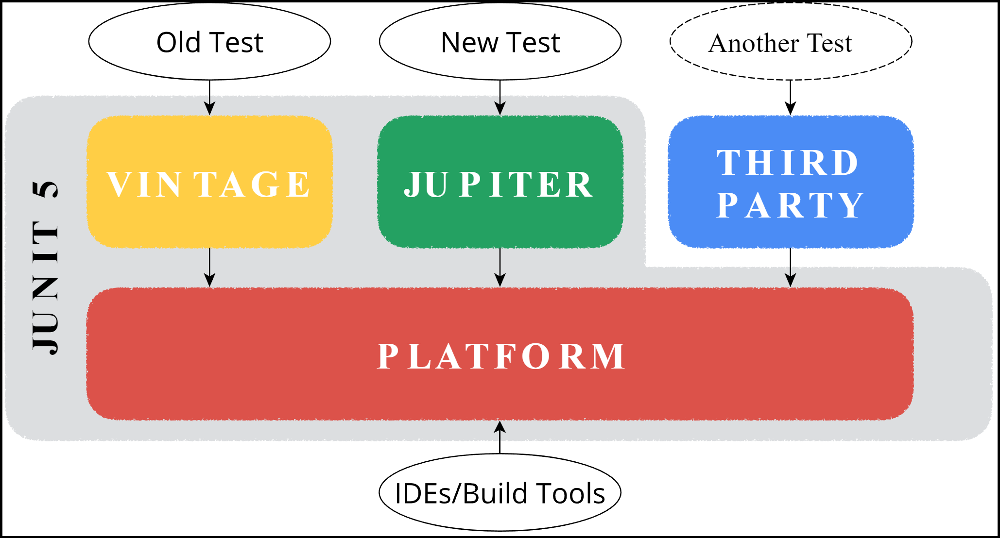
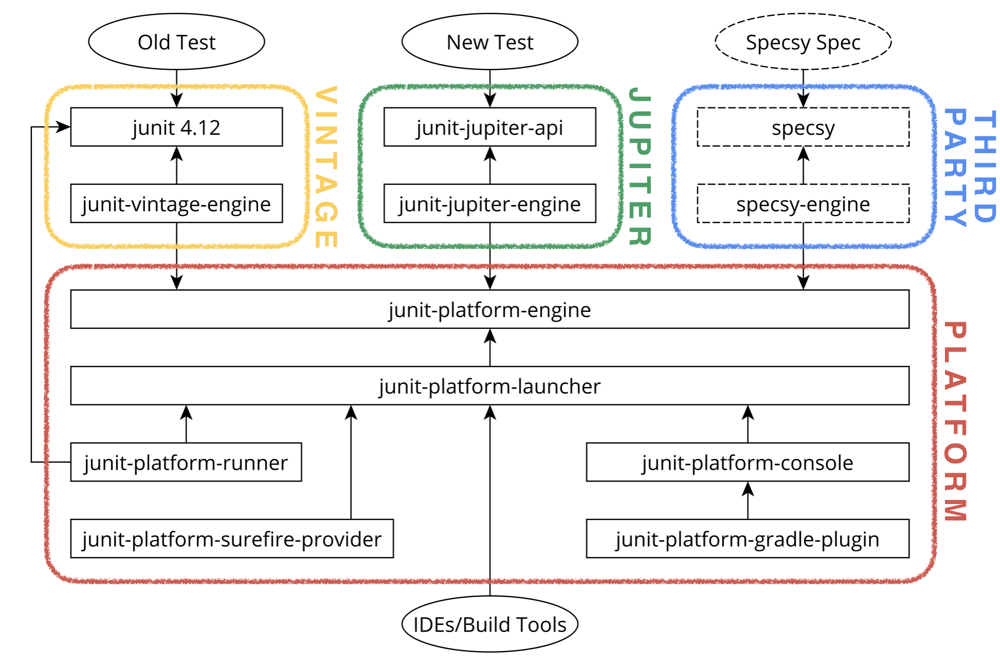

@title[Testing In The Modular World]
# Testing In The
# Modular World

Note: Привет! Welcome!

+++

#### Christian Stein


[MICROMATA](https://www.micromata.de/) Software Engineer<br/> 


JUnit 5 Committer<br/>


Apache Maven Committer<br/>

<small>*Twitter:* [@sormuras](https://twitter.com/sormuras) *Blog:* [sormuras.github.io](https://sormuras.github.io)</small>

+++

@title[Living In The Material World]
#### Living In The Material World
<br>

_"Can't say what I'm doing here_

_But I hope to see much clearer,_

_After living in the material world."_

**George Harrison**

+++

@title[Testing In The Modular World]
#### Testing In The Modular World
<br>

_"Will tell what I'm doing here_

_And I hope you see much clearer,_

_After testing in the modular world."_

+++

@title[Agenda]
#### Testing In The Modular World
## Agenda
<br>

@ul

- Using **JUnit 5** ✅ to launch tests
- Organized in **Java Modules** ☕
- Foundation tools **`javac`**, **`jar`** and **`java`**
- Questions and Answers

@ulend

---

# What is JUnit 5?

+++

## There is **no** JUnit 5

Note:
Not a single artifact.

+++



+++
 
#### JUnit 5 = ...
# Platform
<br>

@ul

- Foundation for launching test engines
- Defines and uses **`TestEngine`** interface

@ulend

+++
 
#### JUnit 5 = Platform + ...
# Jupiter
<br>

@ul

- New programming model for writing tests
- New extension model for writing extensions
- **`JupiterTestEngine implements TestEngine`**

@ulend

+++
 
#### JUnit 5 = Platform + Jupiter + ...
# Vintage
<br>

@ul

- Enables running JUnit 3 and 4 tests
- **`VintageTestEngine implements TestEngine`**

@ulend

+++

#### JUnit 5 = Platform + Jupiter + Vintage + ...
# Your Engine
<br>

@ul

- What is a test? **You define it!**
- How is a test evaluated? **You define it!**
- **`YourTestEngine implements TestEngine`**

@ulend

+++

#### JUnit 5 = Platform + *many engines*
# 3<sup>rd</sup>-party Engines

Specsy, Spek, KotlinTest, Cucumber, Drools, jqwik, ...

<small><https://github.com/junit-team/junit5/wiki/Third-party-Extensions></small>

---

# This is JUnit 5

+++



---

### JUnit Platform
# Launcher

+++

### Launcher API

```java
var request = LauncherDiscoveryRequestBuilder.request()
    .selectors(
        selectPackage("example"),
        selectClass(StandardTests.class),
        selectModule("com.example.tool")
    )
    .filters(
        includeClassNamePatterns(".*Tests")
    )
    .build();

var launcher = LauncherFactory.create();
launcher.execute(request);
```
@[1](Build request...)
@[2-6](Select some resources)
@[7-9](Apply filters)
@[12-13](Execute test plan)

Note:
There’s currently the possibility to select classes, methods, and all classes
in a package or even search for all tests in the classpath.
Discovery takes place across all participating test engines.

+++

### Console Launcher

```text
├─ JUnit Vintage
│  └─ example.JUnit4Tests
│     └─ standardJUnit4Test ✔
└─ JUnit Jupiter
   ├─ StandardTests
   │  ├─ succeedingTest() ✔
   │  └─ skippedTest() ↷ for demonstration purposes
   └─ A special test case
      ├─ Custom test name containing spaces ✔
      ├─ ╯°□°）╯ ✔
      └─ 😱 ✔

Test run finished after 64 ms
```

Note:
The ConsoleLauncher is a command-line Java application that lets you launch
the JUnit Platform from the console.
For example, it can be used to run Vintage and Jupiter tests
and print test execution results to the console.

---

### Test Engine
# Jupiter

+++

### First Jupiter Test

```java
import org.junit.jupiter.api.*;

class FirstJupiterTests {

    @Test
    void myFirstTest() {
        Assertions.assertEquals(2, 1 + 1, "2 is two");
    }

}
```
@[1](Import JUnit Jupiter API)
@[3,6](Use 'package-private' modifier)
@[5-8](@Test-annotated method, also 'package-private')
@[1-10]

+++

### Composed Annotations

```java
@Tag("fast")                     // file: FastSystemTest.java
@Tag("system")
@Test
@interface FastSystemTest {}

@FastSystemTest                  // file: FirstJupiterTests.java
void mySecondTest() {...} 
```
@[1-2](Multiple tags)
@[3](Mark as test)
@[6-7](Use your meta-annotation)
@[1-7]

+++

### Jupiter Features 1
<br>

@ul

- Basic Annotations - *`@Test`*
- Meta-Annotations - *`@FastSystemTest`*
- Display Names - *Emojis! 😎 🐌* @note[Spaces in names...]
- Tagging and Filtering
- Assertions @note[Use external assertion libs. They are good!]
- Assumptions
- Disabling Tests
- Conditional Test Execution

@ulend

+++

### Jupiter Features 2
<br>

@ul

- Test Instance Lifecycle
- Nested Tests
- Dependency Injection
- Test Interfaces
- Repeated Tests - 🔂
- Dynamic Tests
- Test Templates
- Parameterized Tests - ✨

@ulend

+++

### Jupiter Features 3
## User Guide
<br>

https://junit.org/junit5/docs/current/user-guide

Note:
The user guide contains the latest documentation and usage examples.
Most of it explains the Jupiter API and programming model.
Platform and Vintage are covered, too.

+++

### Jupiter Features 4
## 3<sup>rd</sup>-party Extensions

Spring, Mockito, Docker, Wiremock, JPA, Selenium/WebDriver,
DbUnit, Kafka, Jersey, GreenMail, S3Mock, Citrus Framework,
XWiki, ...

<small>https://github.com/junit-team/junit5/wiki/Third-party-Extensions</small>

---

@title[Java Platform Module System]
# Java Platform
# Module System

- JSR 376 <https://jcp.org/en/jsr/detail?id=376>
- Jigsaw <http://openjdk.java.net/projects/jigsaw>

Note: https://twitter.com/mreinhold/status/994669659029999616
Please stop calling it "JPMS", which sounds like an unpleasant medical condition.
It’s just “the Java module system.” #jigsaw #jdk9 #java

+++

### Goals of the ~~JPMS~~
## Java Module System

@ul

- Reliable configuration @note[to replace the brittle, error-prone class-path mechanism with a means for program components to declare explicit dependences upon one another]
- **Strong** encapsulation @note[to allow a component to declare which of its APIs are accessible by other components, and which are not]
- A scalable Java SE Platform @note[whose components can be assembled by developers into custom configurations that contain only the functionality actually required by an application]
- Greater platform integrity @note[to ensure that code that is internal to a platform implementation is not accessible from outside the implementation]
- Improved performance @note[by applying whole-program optimization techniques to complete configurations of platform, library, and application components]

@ulend

+++ 

# What is a module?

_Modules_ are named, self-describing program components consisting of code and data.
A module must be able to contain Java classes and interfaces, as organized into packages,
and also native code, in the form of dynamically-loadable libraries.
A module’s data must be able to contain static resource files and user-editable configuration files.
<small><http://openjdk.java.net/projects/jigsaw/spec/reqs/#fundamentals></small>

+++

# This is a module

- Named program component
- Set of packages (code and data)
- Module meta-data (module descriptor)

---

# Modular Project

+++

# Project Overview

@ul

- Application named 📀 **`com.example.application`**
- contains only **`Main`** entry point and uses...

- Library named 🔨 **`com.example.tool`**
- publishes **`Calculator`**
- uses **`MathHelper`** internally.
<br>
- Bonus! 🍦 **`ice.cream`** test engine

@ulend

+++

#### `tree src/main`

```txt
├──📀 com.example.application
│   ├── com
│   │   └── example
│   │       └── application
│   │           └── 📜 Main.java
│   └── ☕ module-info.java
│
├──🔨 com.example.tool
│   ├── com
│   │   └── example
│   │       └── tool
│   │           ├── 📜 Calculator.java
│   │           └── internal
│   │               └── 📜 MathHelper.java
│   └── ☕ module-info.java
│
└──🍦 ice.cream
    ├── ice
    │   └── cream
    │       ├── 📜 Flavor.java
    │       ├── 🍦 Machine.java
    │       └── 📜 Scoop.java
    └── ☕ module-info.java
```
@[1-6](`module com.example.application`)
@[8-15](`module com.example.tool`)
@[17-23](`module ice.cream`)

+++

#### Main Modules: `module-info.java`

```java
module com.example.tool {          module com.example.application {
  exports com.example.tool; 📁       requires com.example.tool; 🔨
}                                  }
```

```java
module ice.cream {
	requires org.junit.platform.engine; Ⓜ

	provides org.junit.platform.engine.TestEngine 📜
	    with ice.cream.Machine; 🍦
}
```
<small><https://docs.oracle.com/javase/specs/jls/se10/html/jls-7.html#jls-7.7></small>

+++

#### Main Modules: Compile

```sh
javac                            javac
  -d bin/main                      -d bin/main
  --module-source-path src/main    --module-source-path src/main
  --module com.example.tool        --module com.example.application
```
@[1](Compiles Java source files into class files.)
@[2](Sets the destination directory for class files.)
@[3](Specifies where to find input source files for multiple modules.)
@[4](Compiles only the specified module and checks time stamps.)
@[1-4]

Note: Analogue command for the ice.cream module

+++

#### Main Modules: Package

```sh
jar
  --create
  --file       bin/main-jars/com.example.application.jar
  --main-class com.example.application.Main
  -C           bin/main/com.example.application
  .
```
@[1](Archiving and compression tool.)
@[2](Creates the archive.)
@[3](Specifies the archive file name.)
@[4](Specifies the application entry point for standalone applications bundled into a modular or executable modular JAR file.)
@[5-6](Changes the specified directory and includes the files specified at the end of the command line.)
@[1-6]

+++

#### `tree bin`

```txt
├── main
│   ├──📀 com.example.application
│   │   ├── com
│   │   │   └── example
│   │   │       └── application
│   │   │           └── Main.class
│   │   └── module-info.class
│   │
│   ├──🔨 com.example.tool
│   │   ├── com
│   │   │   └── example
│   │   │       └── tool
│   │   │           ├── Calculator.class
│   │   │           └── internal
│   │   │               └── MathHelper.class
│   │   └── module-info.class
│   │
│   └──🍦 ice.cream
│       ├── ice
│       │   └── cream
│       │       ├── Flavor.class
│       │       ├── Machine.class
│       │       └── Scoop.class
│       └── module-info.class
│
└── main-jars
    ├── 📀 com.example.application.jar
    ├── 🔨 com.example.tool.jar
    └── 🍦 ice.cream.jar
```
@[2-7](`module com.example.application`)
@[9-16](`module com.example.tool`)
@[18-24](`module ice.cream`)
@[26-29](Packaged modules, i.e. modular jars)

+++

#### Tool Module 🔨

<small>`jar --describe-module --file bin/main-jars/com.example.tool.jar`</small>

```bash
com.example.tool .../bin/main-jars/...tool.jar/!module-info.class
exports com.example.tool
requires java.base mandated
contains com.example.tool.internal
```
@[1](Module name and archive file)
@[2](Published package)
@[3](Dependency)
@[4](Non-published package)
@[1-4]

+++

#### Application Module 📀

<small>`jar --describe-module --file .../com.example.application.jar`</small>

```bash
com.example.application ...application.jar/!module-info.class
requires com.example.tool
requires java.base mandated
contains com.example.application
main-class com.example.application.Main
```
@[1](Module name and archive file)
@[2-3](Dependencies)
@[4](Non-published package)
@[5](Entry-point)
@[1-5]

+++

#### Ice Cream Module 🍦

<small>`jar --describe-module --file bin/main-jars/ice.cream.jar`</small>

```bash
ice.cream@47.11 .../bin/main-jars/ice.cream.jar/!module-info.class
requires java.base mandated
requires org.junit.platform.engine
provides org.junit.platform.engine.TestEngine
    with ice.cream.Machine
contains ice.cream
```
@[1](Module name, version and archive file)
@[2-3](Dependencies)
@[4-5](Service)
@[6](Non-published package)
@[1-6]

---

# Testing In The
# Modular World

+++

### Organizing Tests 1

Where should I put my test files?

<https://junit.org/junit4/faq.html#organize_1>

```text
main
   com
      xyz
         SomeClass.java
         SomeClassTest.java
```

Note:
You can place your tests in the same package and directory as the classes under test.
While adequate for small projects, many developers feel that this approach clutters
the source directory, and makes it hard to package up client deliverables without
also including unwanted test code, or writing unnecessarily complex packaging tasks.

+++

### Organizing Tests 2

Separate tests into dedicated `test` directory

```text
main
   com
      xyz
         SomeClass.java
test
   com
      xyz
         SomeClassTest.java
```

Note:
An arguably better way is to place the tests in a separate parallel directory structure with package alignment.
These approaches allow the tests to access to all the public and package visible methods of the classes under test.

+++

### Organizing Tests 3

Extrapolate to the Java module system

```text
main
   com.xyz
     com
        xyz
          SomeClass.java
     module-info.java
         
test
   com.xyz
     com
        xyz
         SomeClassTest.java
     module-info.java         
```

Note:
An arguably better way is to place the tests in a separate parallel directory structure with package alignment.
These approaches allow the tests to access to all the public and package visible methods of the classes under test.

---

### Sample Goals
<br>

@ul

- 1 "blackbox" test module 🔲
- 3 "whitebox" test modules 📀 🔨 🍦
- Run multiple engines

@ulend

+++

#### `tree src/test`

```txt
├──🔲 black.box
│   ├── black
│   │   └── box
│   │       ├── 📃 BlackBoxTests.java // Jupiter
│   │       ├── 📃 GoodOldTest.java   // JUnit 4
│   │       └── 📃 JQwikTests.java    // jqwik
│   └── ☕ module-info.java
│
├──📀 com.example.application
│   ├── com
│   │   └── example
│   │       └── application
│   │           └── 📃 MainTests.java
│   └── ☕ module-info.java
│
├──🔨 com.example.tool
│   ├── com
│   │   └── example
│   │       └── tool
│   │           ├── 📃 CalculatorTests.java
│   │           └── internal
│   │               └── 📃 MathHelperTests.java
│   └── ☕ module-info.java
│
└──🍦 ice.cream
    ├── ice
    │   └── cream
    │       ├── 📃 FlavorTests.java
    │       ├── 📃 MachineTests.java
    │       └── 📃 ScoopTests.java
    └── ☕ module-info.java
```
@[1-7](`module black.box`)
@[9-14](`module com.example.application`)
@[16-23](`module com.example.tool`)
@[25-31](`module ice.cream`)

+++

### 3 Solutions

@ul

- Resorting to the `--class-path`
- Patching test binaries into main modules at runtime
- Patching main sources into test modules at compile time

@ulend

---

# 1. Avoid module path
## `--class-path`

+++

### 1. `--class-path`
### Compilation

```text
javac
    -d
      bin/test-classpath
    --class-path
      bin/main-jars/com.example.tool.jar
      bin/main-jars/com.example.application.jar
      bin/main-jars/ice.cream.jar
      lib/junit-platform-commons-1.2.0.jar
      lib/junit-platform-console-1.2.0.jar
      lib/junit-platform-engine-1.2.0.jar
      lib/junit-platform-launcher-1.2.0.jar
      lib/junit-jupiter-api-5.2.0.jar
      lib/junit-jupiter-params-5.2.0.jar
      lib/junit-jupiter-engine-5.2.0.jar
      lib/junit-vintage-engine-5.2.0.jar
      lib/junit-4.12.jar
      lib/hamcrest-core-1.3.jar
      lib/apiguardian-api-1.0.0.jar
      lib/opentest4j-1.1.0.jar
      lib/jqwik-0.8.10.jar
    src/test/black.box/black/box/BlackBoxTests.java
    src/test/black.box/black/box/GoodOldTest.java
    src/test/black.box/black/box/JQwikTests.java
    src/test/com.example.application/com/example/application/MainTests.java
    src/test/com.example.tool/com/example/tool/CalculatorTests.java
    src/test/com.example.tool/com/example/tool/internal/MathHelperTests.java
    src/test/ice.cream/ice/cream/FlavorTests.java
    src/test/ice.cream/ice/cream/MachineTests.java
```
@[2-3](Destination directory)
@[5-7](Main Java archives)
@[8-20](3rd-party Jars)
@[21-28](Test source files)

+++

### `--class-path`
### Test Launch

```text
java
    --class-path
      bin/test-classpath : bin/main-jars/* : lib/*

    org.junit.platform.console.ConsoleLauncher

    --reports-dir
      bin/test-classpath-results/junit-platform
    --scan-class-path
```
@[2-3](All parts we need launch the test plan)
@[5](`ConsoleLauncher` Main-Class)
@[7-9](`ConsoleLauncher` options)

+++

### `--class-path`
### Test Run

```text
╷
├─ JUnit Jupiter ✔
│  ├─ black.box/black.box.BlackBoxTests ✔
│  │  ├─ moduleName() ■ Assumption failed: Unnamed module!
│  │  ├─ add(RepetitionInfo) ✔
│  │  │  ├─ 1 + 5 ✔
│  │  │  ├─ 2 + 5 ✔
[...]
├─ JUnit Vintage ✔
│  └─ black.box.GoodOldTest ✔
│     └─ eighteenEqualsNineAndNine ✔
└─ JQwik Test Engine ✔
   └─ JQwikTests ✔
      ├─ exampleFor1And3Equals4 ✔
      └─ propertyAdd ✔
            2018-05-13T12:01:26.274508
               tries = `1000`
               checks = `1000`
               seed = `7178696498059007779`

Test run finished after 498 ms
```
@[4](Failure due to not running on the `--module-path`)

---

# 2. Patch Runtime
## `--module-path`

Patching test binaries into main modules at runtime

+++

#### 2. Patch `--module-path`
### Compile

```text
javac
        -d
          bin/test-patch-runtime/com.example.tool
        --class-path
          bin/main-jars/com.example.tool.jar
          bin/main-jars/com.example.application.jar
          bin/main-jars/ice.cream.jar
          lib/junit-platform-commons-1.2.0.jar
          lib/junit-platform-console-1.2.0.jar
          lib/junit-platform-engine-1.2.0.jar
          lib/junit-platform-launcher-1.2.0.jar
          lib/junit-jupiter-api-5.2.0.jar
          lib/junit-jupiter-params-5.2.0.jar
          lib/junit-jupiter-engine-5.2.0.jar
          lib/junit-vintage-engine-5.2.0.jar
          lib/junit-4.12.jar
          lib/hamcrest-core-1.3.jar
          lib/apiguardian-api-1.0.0.jar
          lib/opentest4j-1.1.0.jar
          lib/jqwik-0.8.10.jar
        src/test/com.example.tool/com/example/tool/CalculatorTests.java
        src/test/com.example.tool/com/example/tool/internal/MathHelperTests.java
```

+++

```text
java
    --module-path
      bin/main-jars:lib:bin/test-patch-compile/black.box
    --add-modules
      ALL-MODULE-PATH,ALL-DEFAULT
    --patch-module
      com.example.application=bin/test-patch-runtime/com.example.application
    --patch-module
      com.example.tool=bin/test-patch-runtime/com.example.tool
    --patch-module
      ice.cream=bin/test-patch-runtime/ice.cream
    --add-opens
      com.example.application/com.example.application=org.junit.platform.commons
    --add-opens
      com.example.tool/com.example.tool=org.junit.platform.commons
    --add-opens
      com.example.tool/com.example.tool.internal=org.junit.platform.commons
    --add-opens
      ice.cream/ice.cream=org.junit.platform.commons
    --add-reads
      com.example.application=org.junit.jupiter.api
    --add-reads
      com.example.tool=org.junit.jupiter.api
    --module
      org.junit.platform.console
    --reports-dir
      bin/test-patch-runtime-results/junit-platform
    --scan-modules
```

---

# 3. `--module-path`
### Patch Compile

Patching main sources into test modules at compile time

+++

### 🔲 `black.box/module-info.java`

```java
open module black.box {
	requires com.example.application;
	requires com.example.tool;

	requires org.junit.jupiter.api;
	requires junit;
	requires net.jqwik;
}
```
@[1](`module black.box` with `open` qualifier) @note[Permit deep reflection into this module]
@[2-3](Modules under test)
@[4-6](Test framework APIs)

+++

### 🔨 `com.example.tool/module-info.java`

```java
open module com.example.tool {
	exports com.example.tool;

	requires org.junit.jupiter.api;
	requires org.junit.jupiter.params;
}
```
@[1](`module com.example.tool` with `open` qualifier)
@[2](Copied elements from `main` module descriptor)
@[4-5](Test framework APIs)

+++

```text
javac
    -d
      bin/test-patch-compile
    --module-path
      bin/main-jars:lib
    --patch-module
      com.example.application=src/main/com.example.application
    --patch-module
      com.example.tool=src/main/com.example.tool
    --patch-module
      ice.cream=src/main/ice.cream
    --module-source-path
      src/test
    src/test/black.box/black/box/BlackBoxTests.java
    src/test/black.box/black/box/GoodOldTest.java
    src/test/black.box/black/box/JQwikTests.java
    src/test/black.box/module-info.java
    src/test/com.example.application/com/example/application/MainTests.java
    src/test/com.example.application/module-info.java
    src/test/com.example.tool/com/example/tool/CalculatorTests.java
    src/test/com.example.tool/com/example/tool/internal/MathHelperTests.java
    src/test/com.example.tool/module-info.java
    src/test/ice.cream/ice/cream/FlavorTests.java
    src/test/ice.cream/ice/cream/MachineTests.java
    src/test/ice.cream/module-info.java
```

+++

```text
java
    --module-path
      bin/test-patch-compile:bin/main-jars:lib
    --add-modules
      ALL-MODULE-PATH,ALL-DEFAULT
    --module
      org.junit.platform.console
    --reports-dir
      bin/test-patch-compile-results/junit-platform
    --scan-modules
```

---

# Take-away

* There is no JUnit 5 - use JUnit 5! 
* Test your Java modules, in and out.
* **junit5-modular-world** 👉 <small><https://github.com/junit-team/junit5-samples></small>

+++

# Thanks!
#### Do you see much clearer? 

<small>*Twitter:* [@sormuras](https://twitter.com/sormuras) *Web:* [sormuras.github.io](https://sormuras.github.io)</small>
